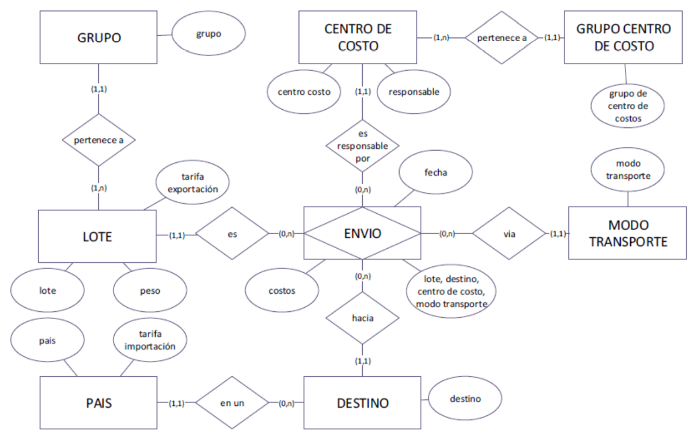
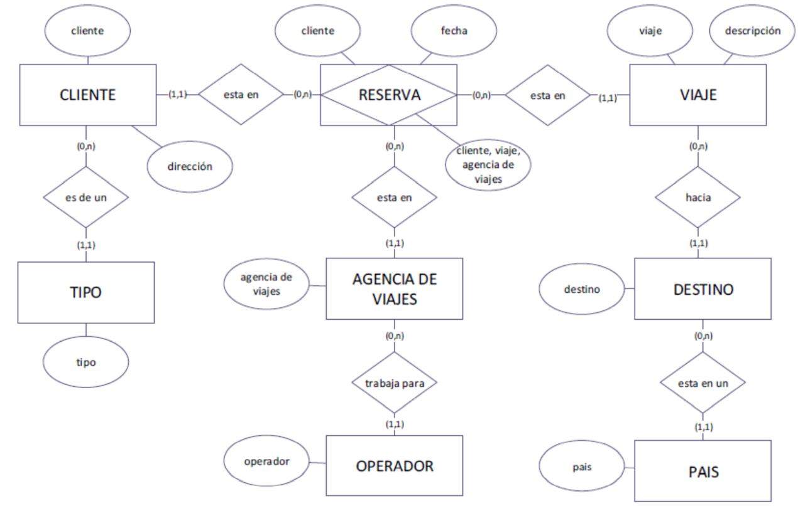
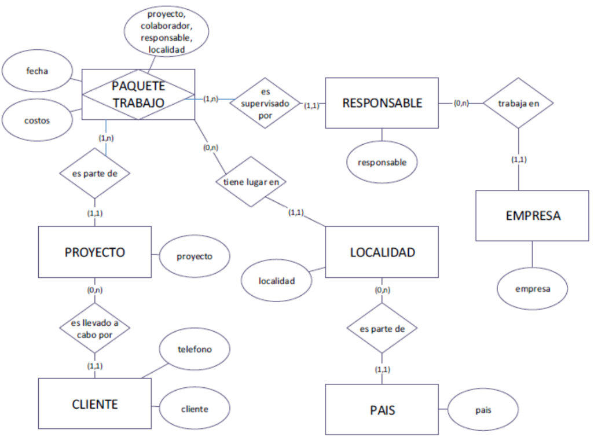

# SESION DE LABORATORIO N° 01: Diseño Mutidimensional

### Nombre:

## OBJETIVOS
  * Realizar el diseño multidimensional de escenarios de negocios con base de datos .

## REQUERIMIENTOS
  * Conocimientos: 
    - Conocimientos básicos de cualquier IDE.
    - Conocimientos básicos de Mermaid.
  * Hardware:
    - Virtualization activada en el BIOS.
    - CPU SLAT-capable feature.
    - Al menos 4GB de RAM.
  * Software:
    - Docker Desktop 
    - Tableu Desktop 20 o superior
## CONSIDERACIONES INICIALES
  * Clonar el repositorio mediante git para tener los recursos necesarios.
  * Colocar su nombre en el archivo

    
## DESARROLLO

### Ejercicio 01: Envios

El siguiente diagrama E/R simplificado describe el envío de mercancías. Los lotes pertenecientes a ciertos grupos se 
envían a ciertos destinos en varios países a través de diferentes modos de transporte. Un cierto centro de costos es 
responsable de cada envío. La dimensión de tiempo consiste en mes y año.

Supongamos que los costos de los atributos ya incluyen todas las tarifas. No se transferirá más información sobre las tarifas
al almacén de datos. El análisis tendrá lugar a nivel del grupo de centros de costos, no se necesita información sobre los 
centros de costos. 
Por favor identifique el hecho de interés y construya el Modelo Dimensional y su respectivo diagrama físico

### Ejercicio N° 02: Reservas de viaje 

En este esquema de E / R, un cliente (que es de cierto tipo) reserva un viaje en una agencia de viajes. La agencia de viajes 
trabaja para un determinado operador turístico. El viaje va a un destino determinado que pertenece a un país determinado. 
La dimensión de tiempo consiste en mes, trimestre y año.

Por favor identifique el hecho de interés y construya el Modelo Dimensional y su respectivo esquema físico

### Ejercicio N° 03: Gestión de proyectos 

Este esquema E / R simplificado muestra un caso gestión del proyecto. 
El proyecto para un cliente se divide en varios paquetes de trabajo y siempre una persona es responsable de completar la 
tarea. Se cuida en un lugar determinado. 
La dimensión de tiempo consiste de día, mes y año

Por favor identifique el hecho de interés y construya el Modelo Dimensional. Incluya un atributo de hecho adicional que 
cuente la cantidad de paquetes de trabajo. Asimismo, realice el diagrama físico

    
## ACTIVIDAD ENCARGADA

1. Generar todos los modelos fisicos de los diagramas entidad relación y modelo dimensional en bases de datos separadas en archivos lenguaje SQL (modelo01.sql, modelo02.sql y modelo03.sql).
2. Contruir la base de datos en Azure utilizando Terraform crear el archivo infra/main.tf.
3. Contruir la automatización (.github/worflows/deployInfra.yml) para que se despliegue la infraestructura creado en el paso previo, teniendo en cuenta los laboratorios anteriores.
4. Contruir la automatización (.github/worflows/deployDatabase.yml) para que se desplieguen los modelos creados en la actividad 1 utilizar el action https://github.com/liquibase-github-actions/update.
